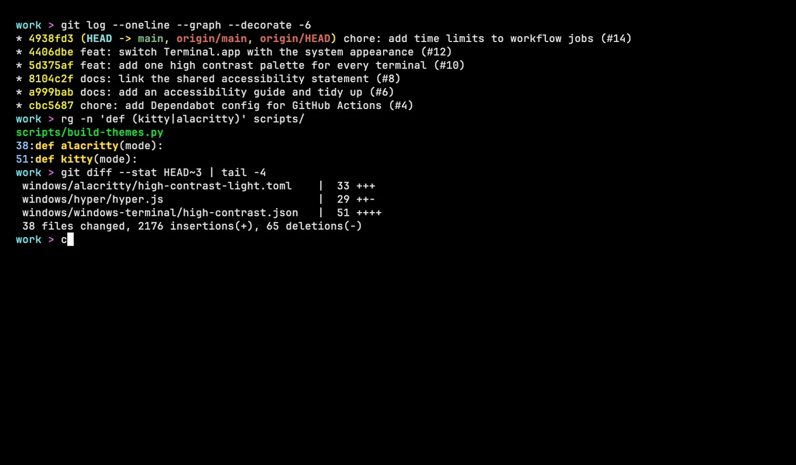
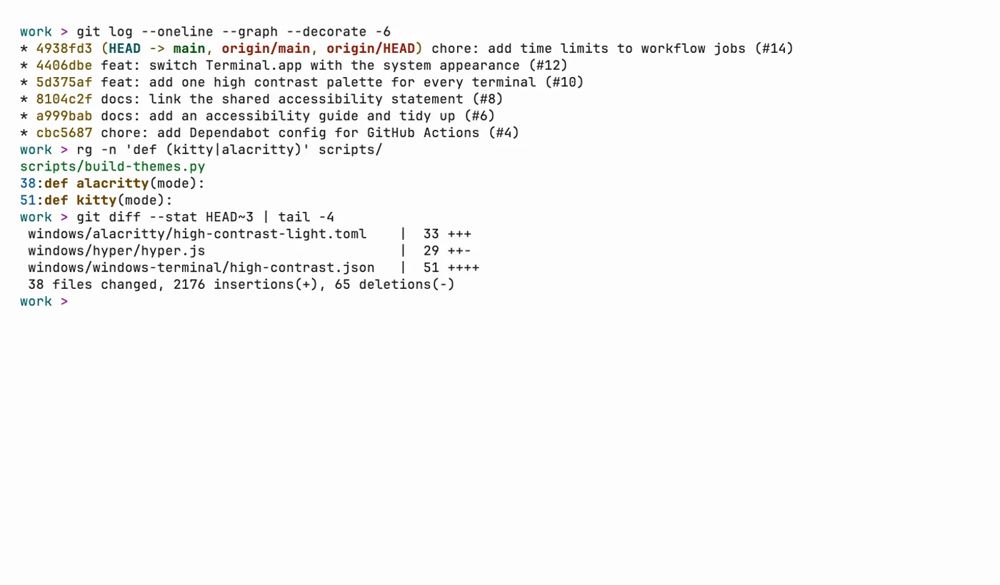
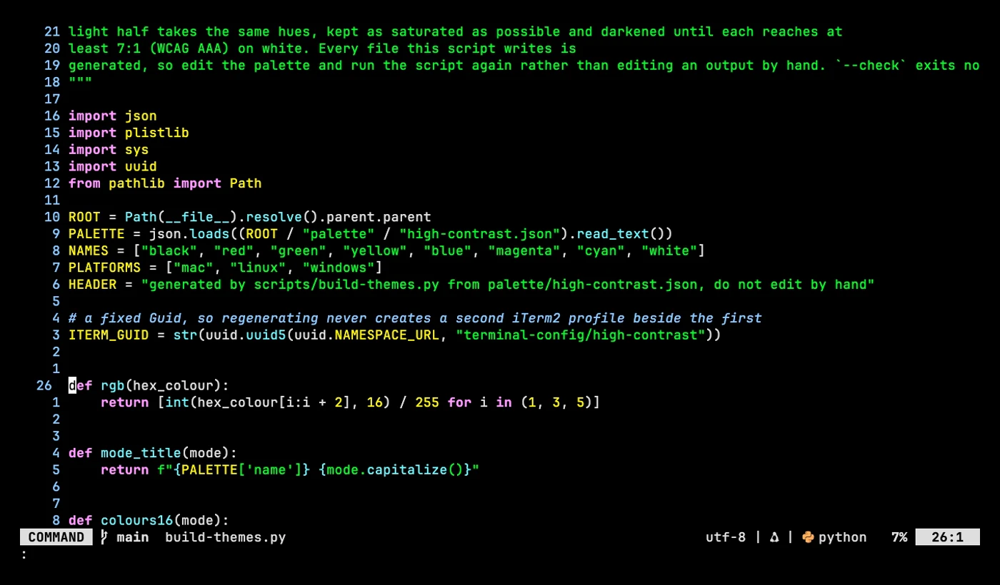
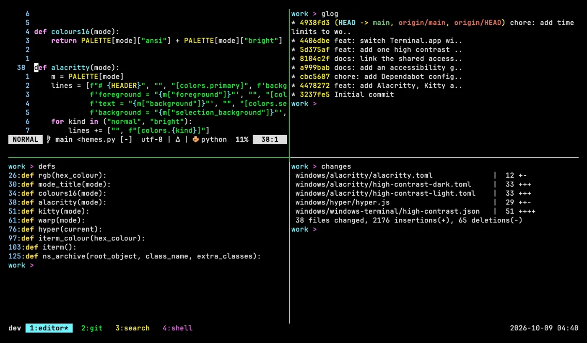
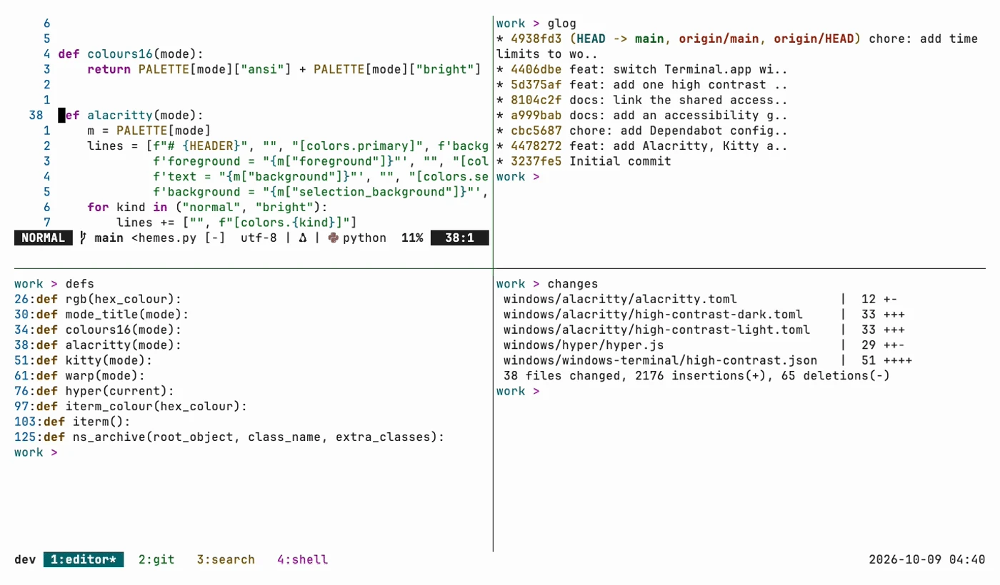

# terminal-config

> One High Contrast colour palette, light and dark, for Terminal.app, iTerm2, Windows Terminal,
> Ptyxis, GNOME Terminal, Alacritty, Kitty and Hyper, plus starter configs with per-platform fonts.

## In action

Screenshots in the High Contrast palette, dark and light. Each one links to a short animation of the same scene.

### Shell

| Dark | Light |
| --- | --- |
|  |  |

### Neovim

| Dark | Light |
| --- | --- |
|  |  |

### tmux

| Dark | Light |
| --- | --- |
|  |  |

## What's here

Every terminal uses the same High Contrast palette: vivid colours on black in dark mode, the same
hues at 7:1 or more on white in light mode. Terminals that can follow the system appearance switch
between the two on their own. The palette lives in one file,
[`palette/high-contrast.json`](palette/high-contrast.json), and
[`scripts/build-themes.py`](scripts/build-themes.py) writes every theme file from it. Colours and
reasoning are in [guides/high-contrast.md](guides/high-contrast.md).

| Terminal | macOS | Linux | Windows |
| --- | --- | --- | --- |
| Alacritty | [`mac/alacritty/`](mac/alacritty/) | [`linux/alacritty/`](linux/alacritty/) | [`windows/alacritty/`](windows/alacritty/) |
| Kitty | [`mac/kitty/`](mac/kitty/) | [`linux/kitty/`](linux/kitty/) | not available, Kitty has no Windows build |
| Hyper | [`mac/hyper/`](mac/hyper/) | [`linux/hyper/`](linux/hyper/) | [`windows/hyper/`](windows/hyper/) |
| Terminal.app | [`mac/terminal-app/`](mac/terminal-app/) | not available | not available |
| iTerm2 | [`mac/iterm2/`](mac/iterm2/) | not available | not available |
| Ptyxis and GNOME Terminal | not available | [`linux/ptyxis/`](linux/ptyxis/), [`linux/gnome-terminal/`](linux/gnome-terminal/) | not available |
| Windows Terminal | not available | not available | [`windows/windows-terminal/`](windows/windows-terminal/) |

## Setup

Full walkthrough in [guides/setup.md](guides/setup.md), with the install path for each terminal
on each platform. Palette and font choices are explained in [guides/reference.md](guides/reference.md).

## Structure

| Path | Contents |
| --- | --- |
| [`ACCESSIBILITY.md`](ACCESSIBILITY.md) | Light and dark contrast, opaque windows and font sizing |
| [`palette/`](palette/) | The High Contrast palette, the single source for every colour |
| [`scripts/`](scripts/) | `build-themes.py`, which writes every theme file from the palette |
| `<platform>/<terminal>/` | That terminal's config file for that platform |
| [`guides/`](guides/) | Setup walkthrough and reference |
