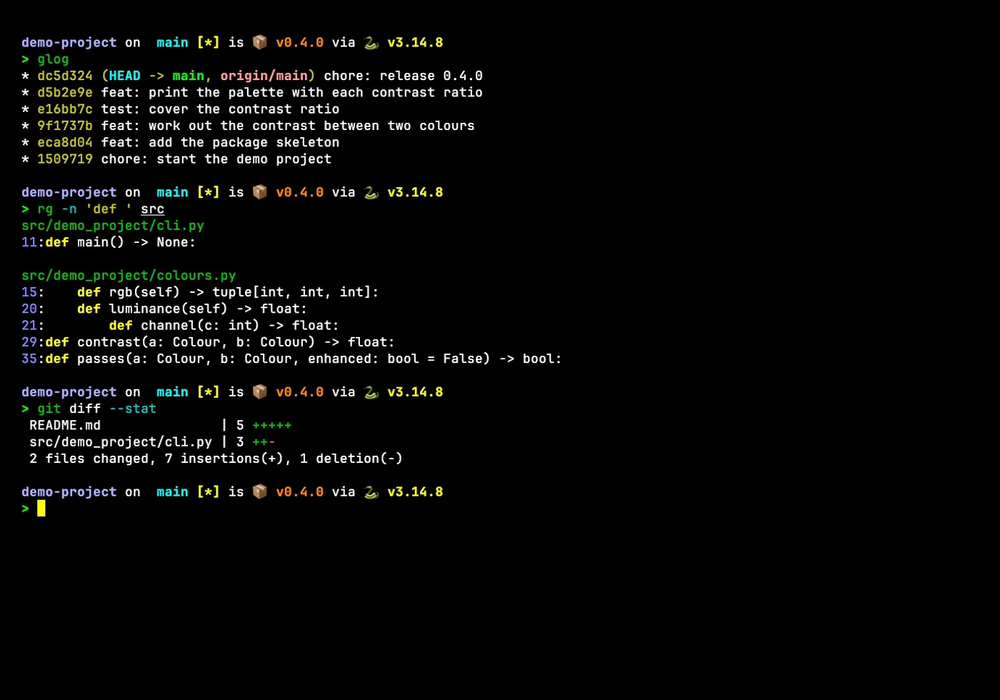

# terminal-config

This repository's terminal configuration has moved to the `terminal/terminal` folder of the dotfiles repository, where it is maintained together with the rest of the developer setup. Changes and issues are handled there.

[Open terminal/terminal in dotfiles](https://github.com/zaccesss/dotfiles/tree/main/terminal/terminal)

> [!NOTE]
> This repository is archived and read-only.

<picture>
  <source media="(prefers-color-scheme: dark)" srcset="docs/demo/shell-dark.webp">
  <source media="(prefers-color-scheme: light)" srcset="docs/demo/shell-light.webp">
  
</picture>
